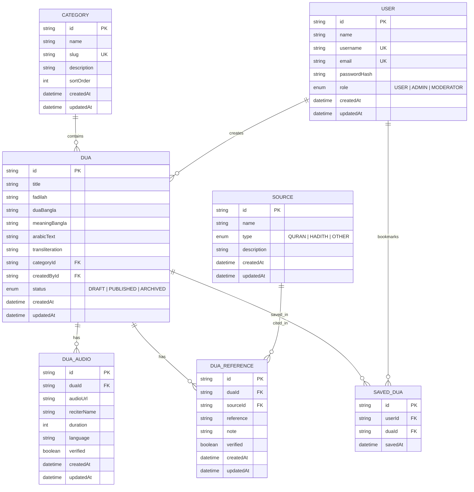

# 🌙 Islamic Dua Platform - Backend API

Production-grade, scalable, and modular backend for the Islamic Dua Application built with **NestJS**, **TypeScript**, **Prisma ORM**, **PostgreSQL**, **class-validator**, and **Swagger/OpenAPI**.

---

## 📁 Architecture & Folder Structure

```text
peacetweet_beckend/
├── prisma/
│   ├── schema/                      # Multi-file Prisma schema
│   │   ├── schema.prisma            # Datasource & Client generator configuration
│   │   ├── enum.prisma              # Role, DuaStatus, SourceType enums
│   │   ├── user.prisma              # User model with role & timestamps
│   │   ├── category.prisma          # Category model with slug & sortOrder
│   │   ├── source.prisma            # Source model (Quran, Hadith, Other)
│   │   ├── dua.prisma               # Core Dua model with full Arabic & Bengali text
│   │   ├── dua_reference.prisma     # Citations linking Dua to Source
│   │   ├── dua_audio.prisma         # Audio recitation metadata and URLs
│   │   └── saved_dua.prisma         # User bookmarked / saved Duas
│   └── schema.prisma                # Consolidated schema
├── src/
│   ├── cache/                       # In-memory TTL Cache provider
│   │   ├── cache.module.ts
│   │   └── cache.service.ts
│   ├── common/                      # Reusable cross-cutting concerns
│   │   ├── constants/               # Global constants & metadata keys
│   │   ├── decorators/              # @Public(), @Roles(), @CurrentUser()
│   │   ├── dto/                     # PaginationQueryDto, ApiResponseDto, ApiErrorResponseDto
│   │   ├── enums/                   # Role, DuaStatus, SourceType
│   │   ├── filters/                 # Centralized HttpExceptionFilter (NestJS + Prisma error mapper)
│   │   ├── guards/                  # JwtAuthGuard, RolesGuard (RBAC)
│   │   ├── interceptors/            # TransformInterceptor (standard JSON format), LoggingInterceptor
│   │   ├── interfaces/              # ActiveUserData, PaginatedResult
│   │   ├── utils/                   # calculatePagination, buildPaginationMeta
│   │   └── common.module.ts
│   ├── data/
│   │   └── seed-data.ts             # Authentic categories, hadith sources, sample Duas
│   ├── database/
│   │   ├── prisma.module.ts         # Global database module
│   │   ├── prisma.service.ts        # PrismaClient lifecycle hooks
│   │   └── seed.ts                  # Database seeder script
│   ├── modules/
│   │   ├── auth/                    # Registration, Login, Refresh Token, Logout, Profile
│   │   ├── users/                   # User profile management
│   │   ├── categories/              # Category CRUD with slug validation & Dua counts
│   │   ├── sources/                 # Quran/Hadith books CRUD
│   │   ├── duas/                    # Dua CRUD, search, category filter, isSaved flag
│   │   ├── dua-references/          # References & Hadith citations
│   │   ├── dua-audios/              # Multi-reciter audio links
│   │   └── bookmarks/               # Saved Duas / Bookmarking with duplicate prevention
│   ├── app.controller.ts            # Health check endpoint (/health)
│   ├── app.module.ts                # Root application module
│   ├── app.service.ts
│   └── main.ts                      # App bootstrap, Swagger (/docs), CORS, validation pipes
├── test/                            # Jest unit & e2e test suites
├── .dockerignore
├── .env
├── .env.example
├── .env.local
├── .gitignore
├── .npmrc
├── .prettierrc
├── docker-compose.yml               # PostgreSQL 16 Alpine container
├── Dockerfile                       # Production multi-stage Docker build
├── eslint.config.mjs
├── jest.config.js
├── nest-cli.json
├── package.json
└── tsconfig.json
```

---

## 🗄️ Database Relationships (Prisma)



---

## 🚀 Step-by-Step Setup & Execution Commands

### 1. Navigate to the backend directory
```bash
cd peacetweet_beckend
```

### 2. Install dependencies with pnpm
```bash
pnpm install
```

### 3. Start PostgreSQL container via Docker
```bash
docker compose up -d
```

### 4. Run Prisma database migrations
```bash
pnpm prisma migrate dev --name init
```

### 5. Seed the database with authentic Islamic data
```bash
pnpm prisma db seed
```
> **Development Credentials Created:**
> - Email: `admin@example.com`
> - Password: `Admin123!`
> - Role: `ADMIN`

### 6. Start the development server
```bash
pnpm start:dev
```
- API Base: [http://localhost:5000/api/v1](http://localhost:5000/api/v1)
- Swagger OpenAPI Docs: [http://localhost:5000/docs](http://localhost:5000/docs)
- Health Check: [http://localhost:5000/api/v1/health](http://localhost:5000/api/v1/health)

### 7. Run Jest Unit & Integration Tests
```bash
pnpm test
```

### 8. Run Linter & Build
```bash
pnpm lint
pnpm build
```

---

## 📡 API Endpoints Overview

### 🔐 Authentication (`/api/v1/auth`)
| Method | Route | Description | Access |
|---|---|---|---|
| `POST` | `/auth/register` | Register new user account | Public |
| `POST` | `/auth/login` | Login (email/username + password) | Public |
| `POST` | `/auth/refresh` | Refresh expired access token | Public |
| `POST` | `/auth/logout` | Invalidate refresh token session | Bearer JWT |
| `GET` | `/auth/me` | Get logged-in user profile | Bearer JWT |

### 👤 User Profile (`/api/v1/users`)
| Method | Route | Description | Access |
|---|---|---|---|
| `GET` | `/users/me` | Get current user profile details | Bearer JWT |
| `PATCH` | `/users/me` | Update current user name or password | Bearer JWT |

### 📂 Categories (`/api/v1/categories`)
| Method | Route | Description | Access |
|---|---|---|---|
| `GET` | `/categories` | List categories (search, sort, pagination) | Public |
| `GET` | `/categories/:id` | Get category by ID or Slug | Public |
| `POST` | `/categories` | Create category | ADMIN / MODERATOR |
| `PATCH` | `/categories/:id` | Update category details | ADMIN / MODERATOR |
| `DELETE` | `/categories/:id` | Delete category (safely prevents if Duas exist) | ADMIN / MODERATOR |

### 📚 Sources (`/api/v1/sources`)
| Method | Route | Description | Access |
|---|---|---|---|
| `GET` | `/sources` | List sources (type filter: QURAN/HADITH/OTHER) | Public |
| `GET` | `/sources/:id` | Get source by ID | Public |
| `POST` | `/sources` | Create source book | ADMIN / MODERATOR |
| `PATCH` | `/sources/:id` | Update source details | ADMIN / MODERATOR |
| `DELETE` | `/sources/:id` | Delete source | ADMIN / MODERATOR |

### 🤲 Duas (`/api/v1/duas`)
| Method | Route | Description | Access |
|---|---|---|---|
| `GET` | `/duas` | List Duas (paginated, category filter, full-text search) | Public / Auth |
| `GET` | `/duas/:id` | Get Dua by ID (includes references, audios, isSaved flag) | Public / Auth |
| `POST` | `/duas` | Create Dua | ADMIN / MODERATOR |
| `PATCH` | `/duas/:id` | Update Dua | ADMIN / MODERATOR |
| `DELETE` | `/duas/:id` | Delete Dua | ADMIN / MODERATOR |

### 🔗 Dua References (`/api/v1/duas/:duaId/references`)
| Method | Route | Description | Access |
|---|---|---|---|
| `GET` | `/duas/:duaId/references` | Get citations for a specific Dua | Public |
| `POST` | `/duas/:duaId/references` | Add reference/hadith citation | ADMIN / MODERATOR |
| `PATCH` | `/duas/:duaId/references/:referenceId` | Update reference | ADMIN / MODERATOR |
| `DELETE` | `/duas/:duaId/references/:referenceId` | Remove reference | ADMIN / MODERATOR |

### 🔊 Dua Audios (`/api/v1/duas/:duaId/audios`)
| Method | Route | Description | Access |
|---|---|---|---|
| `GET` | `/duas/:duaId/audios` | Get audio recitation recordings for a Dua | Public |
| `POST` | `/duas/:duaId/audios` | Add audio link & reciter metadata | ADMIN / MODERATOR |
| `PATCH` | `/duas/:duaId/audios/:audioId` | Update audio metadata | ADMIN / MODERATOR |
| `DELETE` | `/duas/:duaId/audios/:audioId` | Remove audio link | ADMIN / MODERATOR |

### ⭐ Saved Duas / Bookmarks (`/api/v1/users/me/saved-duas` & `/api/v1/duas/:duaId/save`)
| Method | Route | Description | Access |
|---|---|---|---|
| `POST` | `/duas/:duaId/save` | Bookmark/save Dua (Duplicate prevented) | Bearer JWT |
| `DELETE` | `/duas/:duaId/save` | Remove Dua from bookmarks | Bearer JWT |
| `GET` | `/users/me/saved-duas` | Get paginated list of saved Duas | Bearer JWT |

---

## 🛡️ Response & Error Format

### Success Response
```json
{
  "success": true,
  "message": "Data retrieved successfully",
  "data": { ... },
  "meta": {
    "total": 12,
    "page": 1,
    "limit": 10,
    "totalPages": 2,
    "hasNextPage": true,
    "hasPreviousPage": false
  }
}
```

### Error Response
```json
{
  "success": false,
  "message": "A record with this email already exists.",
  "code": "DUPLICATE_RECORD",
  "timestamp": "2026-09-24T16:15:00.000Z"
}
```
